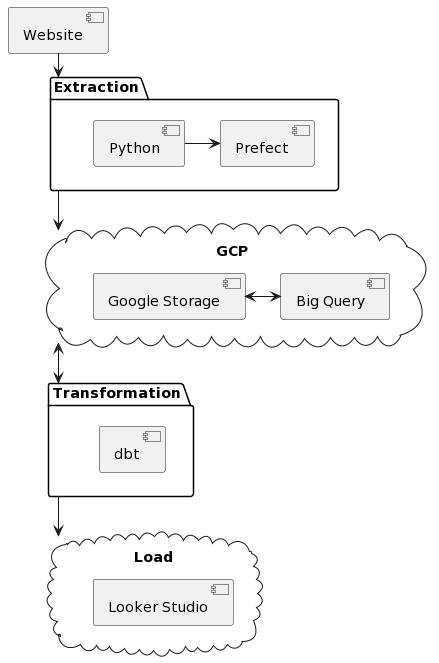

## 0.0. Proposta
O objetivo deste projeto é criar um fluxo de trabalho para ingerir dados de taxi yellow do site da TLC (https://www.nyc.gov/site/tlc/about/tlc-trip-record-data.page), armazená-los no Google Cloud Storage para que a equipe de Data Science possa montar previsões.

### Requisitos
- Acesso ao site da TLC
- Conta no Google Cloud Platform

### Escopo
- **Extração dos dados:** A tarefa de extração será responsável por baixar os dados do site da TLC.
- **Transformação dos dados:** A tarefa de transformação será responsável por limpar e transformar os dados para o formato desejado, assim como otimizações necessárias para redução de custos.
- **Carregamento dos dados:** A tarefa de carregamento será responsável por armazenar os dados no Google Cloud Storage.
- **Relatório:** Será criado um dashboard para visualização das principais métricas.

### Riscos
- **Disponibilidade dos dados:** Os dados são disponibilizados pela TLC em formato CSV. No entanto, é possível que os dados estejam indisponíveis por algum motivo.
- **Qualidade dos dados:** Os dados podem conter erros ou inconsistências.
- **Escalabilidade:** O fluxo de trabalho deve ser capaz de lidar com grandes volumes de dados.

### Métricas de sucesso
- **Tempo de ingestão dos dados:** O fluxo de trabalho deve ser capaz de ingerir os dados em um tempo razoável.
- **Qualidade dos dados:** Os dados ingeridos devem estar livres de erros e inconsistências.
- **Escalabilidade:** O fluxo de trabalho deve ser capaz de lidar com grandes volumes de dados.

### Conclusão
Este projeto é importante para garantir a disponibilidade e a qualidade dos dados de taxi yellow. Os dados ingeridos podem ser usados para uma variedade de aplicações, como análise de transporte, planejamento urbano e marketing.

## 1.0. Arquitetura

### 1.1. Sobre os dados utilizados
- Os registros de viagens de táxis amarelos e verdes incluem informações como datas e horários de embarque e desembarque, locais de embarque e desembarque, distâncias, tarifas, tipos de pagamento e contagens de passageiros.
- Os registros de viagens de veículos de aluguel (FHV) incluem informações sobre a base de despacho, datas e locais de embarque.
- Os dados de registros de viagens de táxis e FHV são fornecidos por provedores de tecnologia e bases autorizados.
- A TLC não garante a precisão dos dados.
- Os arquivos de registros de viagem agora estão no formato PARQUET.
- Os dados de viagens de táxis são publicados mensalmente com um atraso de dois meses.
- Colunas adicionais foram adicionadas aos arquivos de registros de viagens HVFHV e amarelas.

| Variável              | Descrição                                                                                                                                                                                                                                                                                                                             |
| --------------------- | ------------------------------------------------------------------------------------------------------------------------------------------------------------------------------------------------------------------------------------------------------------------------------------------------------------------------------------- |
| VendorId              | Código indicando o provedor TPEP que forneceu o registro. 1= Creative Mobile Technologies, LLC; 2= VeriFone Inc.                                                                                                                                                                                                                      |
| tpep_pickup_datetime  | Data e hora em que o taxímetro foi acionado.                                                                                                                                                                                                                                                                                          |
| tpep_dropoff_datetime | Data e hora em que o taxímetro foi desativado.                                                                                                                                                                                                                                                                                        |
| Passenger_count       | Número de passageiros no veículo. Este é um valor inserido pelo motorista.                                                                                                                                                                                                                                                            |
| Trip_distance         | Distância percorrida durante a viagem em milhas, conforme relatado pelo taxímetro.                                                                                                                                                                                                                                                    |
| PULocationID          | Zona de táxi TLC na qual o taxímetro foi acionado                                                                                                                                                                                                                                                                                     |
| DOLocationID          | Zona de táxi TLC na qual o taxímetro foi desativado                                                                                                                                                                                                                                                                                   |
| RateCodeID            | O código de tarifa final em vigor no final da viagem. 1= Tarifa padrão 2= JFK 3= Newark 4= Nassau ou Westchester 5= Tarifa negociada 6= Viagem em grupo                                                                                                                                                                               |
| Store_and_fwd_flag    | Este sinalizador indica se o registro de viagem foi armazenado na memória do veículo antes de ser enviado ao fornecedor, também conhecido como "armazenamento e encaminhamento", porque o veículo não tinha conexão com o servidor. Y= viagem de armazenamento e encaminhamento N= não é uma viagem de armazenamento e encaminhamento |
| Payment_type          | Um código numérico que indica como o passageiro pagou pela viagem. 1= Cartão de crédito 2= Dinheiro 3= Sem cobrança 4= Disputa 5= Desconhecido 6= Viagem cancelada                                                                                                                                                                    |
| Fare_amount           | A tarifa de tempo e distância calculada pelo taxímetro.                                                                                                                                                                                                                                                                               |
| Extra                 | Extras e sobretaxas diversas. Atualmente, isso inclui apenas as taxas de hora do rush e noturnas de $ 0,50 e $ 1.                                                                                                                                                                                                                     |
| MTA_tax               | Taxa de $ 0,50 da MTA que é automaticamente acionada com base na tarifa do taxímetro em uso.                                                                                                                                                                                                                                          |
| Improvement_surchage  | Sobretaxa de melhoria de $ 0,30 aplicada a viagens no momento da queda da bandeira. A sobretaxa de melhoria começou a ser cobrada em 2015.                                                                                                                                                                                            |
| Tip_amount            | Valor da gorjeta – Este campo é automaticamente preenchido para gorjetas de cartão de crédito. Gorjetas em dinheiro não estão incluídas.                                                                                                                                                                                              |
| Tolls_amount          | Valor total de todos os pedágios pagos na viagem.                                                                                                                                                                                                                                                                                     |
| Total_amount          | Valor total cobrado dos passageiros. Não inclui gorjetas em dinheiro.                                                                                                                                                                                                                                                                 |
| Congestion_Surcharge  | Valor total coletado na viagem pela sobretaxa de congestionamento do NYS.                                                                                                                                                                                                                                                             |
| Airport_fee           | $ 1,25 apenas para embarque nos aeroportos LaGuardia e John F. Kennedy                                                                                                                                                                                                                                                                |

Para maiores informações:

- [Website](https://www.nyc.gov/site/tlc/about/tlc-trip-record-data.page)
- [Data Dictionary](https://www.nyc.gov/assets/tlc/downloads/pdf/data_dictionary_trip_records_yellow.pdf)

### 1.2. Extração

Para extrair os dados iremos utilizar a biblioteca Prefect do Python, que é uma ferramenta utilizada para orquestração de fluxos de trabalho, permitindo desenvolvedores automatizarem a execução de tarefas. Ela é escrita em Python e é de código aberto (open source).
Porque iremos utilizar a ferramenta Prefect:

1. **Automatização de tarefas:** A Prefect pode ser usada para automatizar tarefas repetitivas ou complexas.
2. **Integração de sistemas:** A Prefect pode ser usada para integrar sistemas diferentes.
3. **Gerenciamento de processos de negócios:** A Prefect pode ser usada para gerenciar processos de negócios complexos.
4. **Variáveis de ambiente:** Ele armazena nossas variáveis de ambiente para criarmos conexões seguras.

### 1.3. Transformação

Para transformação dos dados iremos utilizar o DBT (Data Build Tool) que é uma ferramenta de transformação que permite o uso de linguagem SQL para criação de deploys com as melhores práticas da engenharia de software. O dbt é open source e permite:
1. Construir e executar projetos através de arquivos *.sql* e *.yml*
2. Inclue compilação lógica de SQL, macros e adaptadores de database
3. Uma interface CLI que roda os comandos dbt localmente (ele possui uma versão paga  com GUI)
Iremos integrar o dbt com o Big Query do plataforma do Google Cloud.

## 2.0. Plataforma
A plataforma para gerenciar e fazer todas as etapas end-to-end será a Google Cloud Plataform (GCP), uma plataforma em nuvem que oferece uma ampla gama de serviços para nossa ingestão de dados. 
GCP é organizado por *projetos*. Podemos criar projetos e acessa-los pelo dashboard principal.
Então nosso primeiro passo é criar um novo projeto e um *service account*, onde iremos fazer o download da chave de autorização (authentication keys) para o nosso computador. Um *service account* é como uma conta de usuário mas para apps e workloads, você cria uma chave que te da permissões para uso de recursos avaliados na plataforma.

### 2.1. Máquina Virtual

Iremos criar uma máquina virtual chamada Compute Engine, permitindo que criemos uma VM personalizada para atender as necessidades específicas. Não precisaremos de nada robusto mas teremos um custo por hora nessa aplicação. Aqui é onde faremos nosso processamento de dados.

### 2.2. Data Lake

Um data lake é um repositório central de dados que armazena dados de diferentes fontes, formatos e estruturas. Eles trazem flexibilidade, escalabilidade e agilidade como principais benefícios. Para o nosso projeto iremos utilizar o Google Storage para armazenar e processar nossos dados. 

### 2.3. Data Warehouse

Um data warehouse é um sistema de armazenamento de dados que coleta e organiza dados de diferentes fontes. São frequentemente usados para armazenar dados históricos, que são usados para identificar insights e tendências. Eles também armazenam dados atuais, utilizados para monitorar o desempenho e tomar decisões em tempo real.
Viabilizando agilidade, estrutura de dados e redução de custos iremos utilizar o Big Query.

### 2.4. Setup para o GCP

Precisamos configurar o acesso primeiro atribuindo as funções IAM de Administrador de armazenamento, Administrador de objeto de armazenamento, Administrador do BigQuery e Visualizador à conta de serviço e, em seguida, habilitar as APIs iam e `iamcredentials` para o nosso projeto.

Por favor, siga estes passos:

1. Atribua as seguintes funções IAM à conta de serviço: Administrador de armazenamento, Administrador de objeto de armazenamento, Administrador do BigQuery e Visualizador.
    - No painel do projeto GCP, vá para IAM e administração > IAM.
    - Selecione a conta de serviço criada anteriormente e edite as permissões clicando no ícone de lápis à esquerda.
    - Adicione as seguintes funções e clique em Salvar depois:
        - Administrador de armazenamento: para criar e gerenciar buckets.
        - Administrador de objeto de armazenamento: para criar e gerenciar objetos dentro dos buckets.
        - Administrador do BigQuery: para gerenciar recursos e dados do BigQuery.
        - Visualizador já deve estar presente como uma função.
2. Habilite as APIs para o projeto (elas são necessárias para que o Terraform possa interagir com o GCP):
    
    - https://console.cloud.google.com/apis/library/iam.googleapis.com: https://console.cloud.google.com/apis/library/iam.googleapis.com
    - https://console.cloud.google.com/apis/library/iamcredentials.googleapis.com: https://console.cloud.google.com/apis/library/iamcredentials.googleapis.com
    
4. Certifique-se de que a variável de ambiente GOOGLE_APPLICATION_CREDENTIALS esteja definida.

